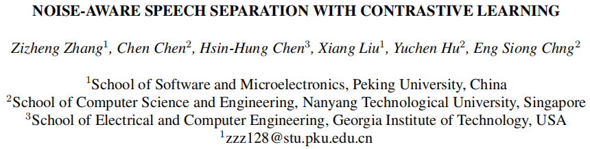

# Noise-Aware Speech Separation (NASS)

This repository provides the example of Sepformer (NASS) on Libri2Mix based on SpeechBrain.

## Install with GitHub

Once you have created your Python environment (Python 3.7+) you can simply type:

```shell
git clone https://github.com/TzuchengChang/NASS
cd NASS
pip install -r requirements.txt
pip install --editable .
pip install mir-eval
pip install pyloudnorm
```

## Introduction

|    |
|-----------------------|

|  |
|----------------------|

|    |  |
|-----------------------|---------------------|

In this paper, we propose a noise-aware speech separation (NASS) method, which aims to improve the speech quality for separated signals under noisy conditions. Specifically, NASS views background noise as an additional output and predicts it with other speakers in a mask-based manner. Then we conduct patch-wise contrastive learning on feature level to minimize the mutual information between the predicted noise output and other speakers, which suppresses the noise information in separated signals, and vice versa. Experimental results show that NASS could achieve competitive results on different datasets, and significantly improve the noise-robustness for different mask-based SS backbones with less than 0.1M parameter increase.

## Run NASS Method #####

Step1: Prepare datasets. 
Please refer to [LibriMix repository](https://github.com/JorisCos/LibriMix).

Step2: Modify configurations.
Configuration files are saved in `NASS/recipes/LibriMix/separation/hparams/`

Step3: Run NASS method.

```shell
cd NASS/recipes/LibriMix/separation/
python train.py hparams/sepformer-libri2mix.yaml --data_folder /yourpath/Libri2Mix/
```

We also provide a yaml for custom data, and make sure your custom folder structure is like Libri2Mix.

```shell
python train.py hparams/sepformer-libri2mix-custom.yaml
 --data_folder /yourpath/custom/
```

## Pretrained Model #####

We provide a pretrained model on [github releases](https://github.com/TzuchengChang/NASS/releases/tag/Pretrained_Model).

To use it, download "results.zip" and unzip it to `NASS/recipes/LibriMix/separation/`

Then run NASS method.

## Cite Our Paper #####

Please cite our [paper](https://arxiv.org/abs/2305.10761).

```
@misc{zhang2023noiseaware,
      title={Noise-Aware Speech Separation with Contrastive Learning}, 
      author={Zizheng Zhang and Chen Chen and Hsin-Hung Chen and Xiang Liu and Yuchen Hu and Eng Siong Chng},
      year={2023},
      eprint={2305.10761},
      archivePrefix={arXiv},
      primaryClass={cs.SD}
}
```
